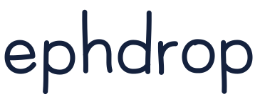
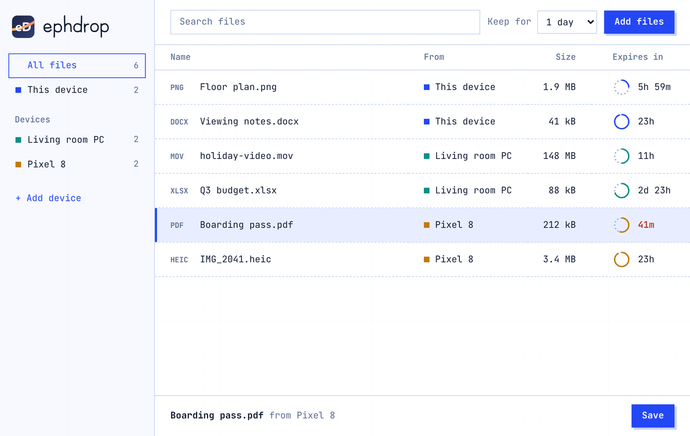
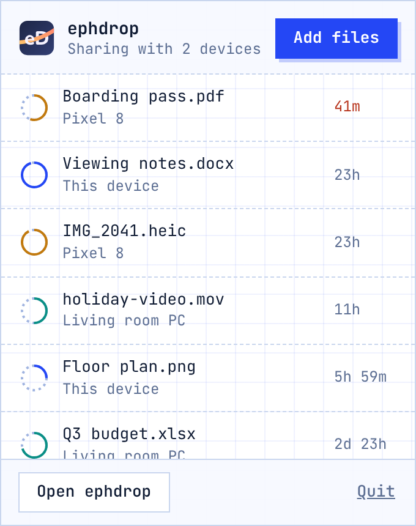

<p align="center">
  
</p>

<p align="center">
  <picture>
    <source media="(prefers-color-scheme: dark)" srcset="design/logo/wordmark-regular-light.svg">
    
  </picture>
</p>

<p align="center">
  <strong>A local dropbox for your home.</strong><br>
  Drop a file on one device, pull it on another. It deletes itself after a day.<br>
  No cloud. No account. No server.
</p>

<p align="center">
  <a href="LICENSE"></a>
  <a href="https://github.com/ShravanAmudala55/ephdrop/actions/workflows/ci.yml"></a>
  <a href="CONTRIBUTING.md"></a>
  
</p>

<p align="center">
  
</p>

## Why

Homes mix iPhone, Android, Windows and Mac, and moving one file between them is still annoying. Email and chat apps upload your files to someone else's server. AirDrop and Quick Share each only talk to their own kind.

ephdrop is one small app for all of them. Devices find each other on your Wi-Fi and send files directly.

- **Nothing leaves your network.** There is no server in the middle and no internet connection is used.
- **No account.** Pair two devices once by scanning a QR code.
- **Files expire.** Every file has a timer, one day by default. The ring next to it shows how much is left, and each device deletes the file on its own when time is up.
- **Tap to pull.** Devices share a list of what is available. A file is only downloaded when you ask for it.

## Where it works

Every platform has its own app over the same Go core, so any mix of devices works together.

| Device | How it runs | Status |
|--------|-------------|--------|
| Mac | Menu bar app. Stays in sync in the background | Tried on a real Mac |
| Windows | Tray app. Stays in sync in the background | Tried on a real laptop |
| Linux | Tray app (AppImage and .deb) | Builds and passes tests. Not tried on a real desktop yet |
| Android | App with a background service | Written. Not built on a phone yet |
| iPhone and iPad | App that runs while it is open, installed with SideStore | Written. Not built on a device yet |

iPhones do not let apps keep sharing in the background. On an iPhone, open ephdrop to see the list and pull files. Files shared from the phone can be fetched by your other devices while the app is open.

## Download

Get the installer for your computer from the [latest release](https://github.com/ShravanAmudala55/ephdrop/releases/latest):

| Computer | File |
|----------|------|
| Mac | `.dmg` |
| Windows | `.exe` installer |
| Linux | `.AppImage` or `.deb` |

The apps are not code-signed yet, because signing costs money. Your computer will warn you the first time:

- **Mac:** it says the app is from an "unidentified developer". Right-click the app, choose **Open**, then **Open** again.
- **Windows:** SmartScreen shows a warning. Click **More info**, then **Run anyway**.

For Android and iPhone, see [Android and iPhone](#android-and-iphone) below.

## Try it

### Build the desktop app yourself

You need [Node.js](https://nodejs.org) and [Go](https://go.dev/dl/).

```
git clone https://github.com/ShravanAmudala55/ephdrop
cd ephdrop/desktop
npm install
npm start
```

`npm start` builds the background program and opens the app. Installers are built with `npm run dist` (see [desktop/README.md](desktop/README.md)). The installers for all three systems are built automatically for each [release](https://github.com/ShravanAmudala55/ephdrop/releases). The Mac and Windows installers build successfully but have not been installed and run on a real machine from the release yet.

### Android and iPhone

See [clients/android](clients/android/README.md) and [clients/ios](clients/ios/README.md). Both build the same Go program with gomobile and wrap the same window in a thin native shell.

### Pair two devices

1. On the first device choose **Add device**. It shows a QR code.
2. On the second device choose **Add device**. A phone scans the code. A computer pastes it (scanning on computers is not built yet). A code works once and stops after five minutes.
3. Accept on the first device. They stay paired until you remove one.

## How it feels

<p align="center">
  
</p>

- Add files by dragging them onto the window, or with **Add files**. On a phone, use the Share menu.
- On a computer, drag a file out of the window straight onto your desktop or into another app.
- Click the menu bar or tray icon for a small panel with your latest files.
- Choose how long files stay (1 hour to 7 days) with **Keep for**.

## How it works

```
 your phone                          your laptop
┌──────────────┐   same Wi-Fi    ┌──────────────┐
│ ephdrop app  │ ◄── mDNS ─────► │ ephdrop app  │
│  Go core     │                 │  Go core     │
│   own files  │ ◄── TLS 1.3 ──► │   own files  │
└──────────────┘  direct, paired └──────────────┘
```

- **Finding each other:** devices announce themselves with DNS-SD (`_ephdrop._tcp`). Phones use the system's own Bonjour or NSD.
- **Knowing who is who:** each device makes an ed25519 key on first run. Its id is a hash of the public key.
- **Pairing:** the QR code carries the inviter's key and addresses plus a one-time secret. Both sides must confirm. After that each device only talks to devices it has paired with.
- **Moving files:** a TLS 1.3 connection pinned to the paired key. A file is only sent when the other device asks for it.
- **Expiry:** each file has an expiry time stored with it. A sweep removes expired files and the list never shows them.

The longer version, including what is not protected, is in [docs/design.md](docs/design.md).

## Help build it

ephdrop is young, and there is real work for people who want to help. You can:

- **Try it** on your own devices and tell us what happened. Real-device reports are the most useful thing right now.
- **Pick up something from the list** in [CONTRIBUTING.md](CONTRIBUTING.md). Each item says what it is and who it suits. Docs, Linux testing, Android, iPhone and Go are all open.
- **Report a bug or share an idea** in [issues](https://github.com/ShravanAmudala55/ephdrop/issues).

You do not have to write code. If ephdrop sounds useful, a star on GitHub helps other people find it.

## Not for

- Backup or long term sync. Use Syncthing or similar.
- Sending files over the internet.
- Version history or merging changes.

## Project layout

```
core/             Go: identity, pairing, discovery, shelf, transfer, board, node, api
core/mobile/      The small Go interface the phone apps use
desktop/          Electron app for Mac, Windows and Linux
clients/android/  Android app (Kotlin)
clients/ios/      iPhone and iPad app (SwiftUI)
design/logo/      Logo, wordmark and tray icons
docs/             Design notes
TRACKING.md       Plan, decisions and progress
```

## Tests

```
cd core && go test -race ./...
cd desktop && npm test        # needs xvfb, Linux only
```

The tests cover the Go core (including two devices pairing and sharing end to end) and the desktop app in a real Electron window.

## Status

Early. The core and the desktop apps work and were tried between a Mac and a Windows laptop. The phone apps are written but have not been built on a real device, so expect rough edges. Progress and open questions are in [TRACKING.md](TRACKING.md).

## License

[MIT](LICENSE). The JetBrains Mono font in the window is under the SIL Open Font License, see `core/api/ui/fonts/OFL.txt`.
